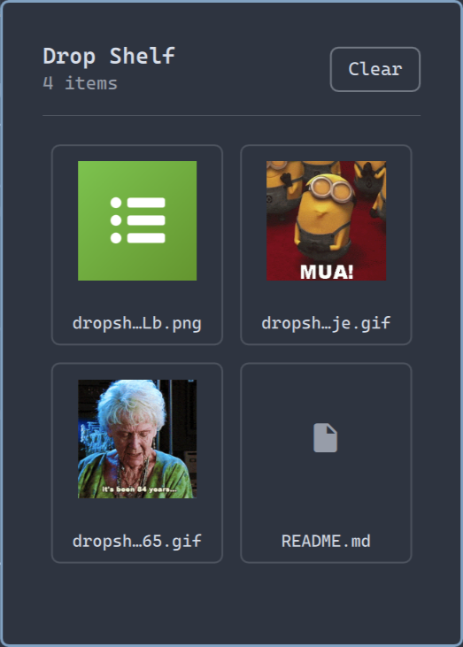

# Drop Shelf

A persistent floating shelf for Omarchy. Drop files or images onto it, then drag them into any application that accepts file drops.

Drop Shelf stores file URI references only. It never moves, copies, or deletes the original files. Browser images are downloaded into a private local data directory so they can be dragged out as normal file drops.



## Install

```bash
omarchy plugin add https://github.com/mranallo/omarchy-dropshelf.git --enable
```

The Drop Shelf icon is added to the right side of the Omarchy bar. Click it to open the shelf beneath the icon. The shelf follows the icon when it is moved between the left, center, or right bar sections.

## Use

1. Click the shelf icon in the Omarchy bar.
2. Drag local files onto the window — or drag images straight from the browser, including Google Images results and Giphy.
3. Drag a shelf item into another application. The item is removed from the shelf after the drag; press **Undo** to restore it if the drop didn't land.
4. Remove an individual reference with its `x` button, or use **Clear**.

Removing an item never touches the original file.

## Keyboard shortcut (optional)

The shelf can be toggled from the command line, so you can bind it to a key. In `~/.config/hypr/bindings.lua`:

```lua
o.bind("SUPER + D", "Drop Shelf", "omarchy shell shell toggle io.github.mranallo.dropshelf '{}'")
```

When opened this way the shelf anchors near the top-left of the screen instead of under the bar icon.

## Configuration

Drop Shelf needs no configuration. Its data lives at:

- Shelf contents: `$XDG_STATE_HOME/omarchy-dropshelf/shelf.json` (default `~/.local/state/omarchy-dropshelf/shelf.json`)
- Downloaded browser images: `$XDG_DATA_HOME/omarchy-dropshelf` (default `~/.local/share/omarchy-dropshelf`)

## Remove

```bash
omarchy plugin remove io.github.mranallo.dropshelf
```

Optionally delete the state and data directories listed above.

## Development

Validate the plugin and run the model tests:

```bash
omarchy plugin validate .
node tests/model.test.js
```

To install a development checkout, link or copy this directory to:

```text
~/.config/omarchy/plugins/io.github.mranallo.dropshelf
```

Plugin files hot-reload while Omarchy Shell is running.

## License

MIT
